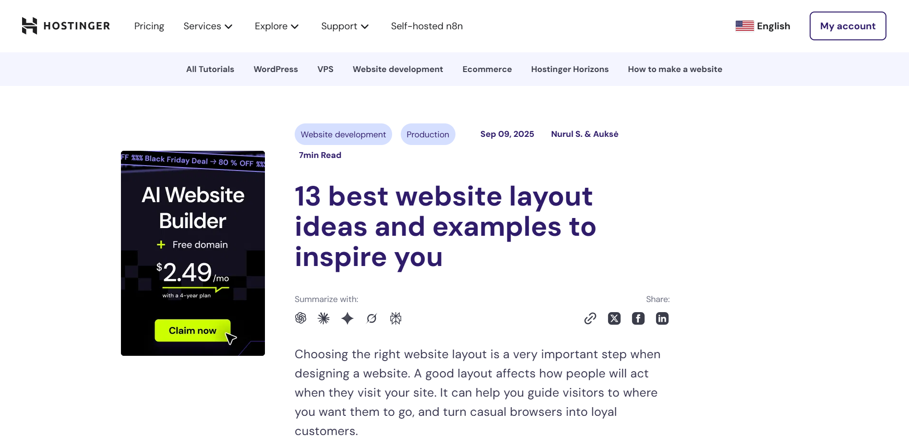
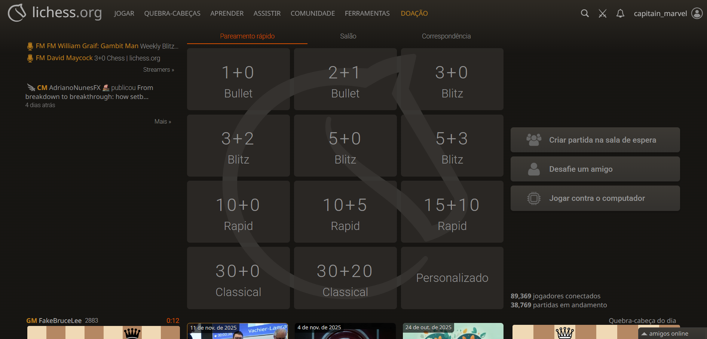
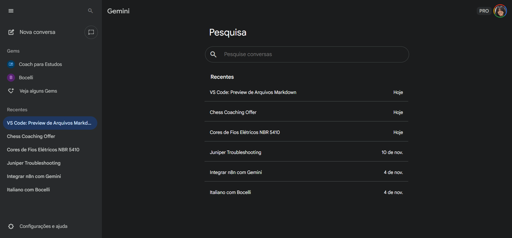

# Hostinger

- O menu fica do lado de cima, e tem setas para indicar que tem mais opções.
- Abaixo de outra cor que serve para dividir o menu da área do blog, tem opções para filtrar, espaçadas com tamanho fixo e cada opçao tem um tamanho de palavra diferente.
- A parte de idioma tem um bandeira e o nome no idioma no mesmo tipo de letra que o navbar, mas em negrito, e a parte de conta está circulada para dar mais destaque
- A logo deles é roxa, entao usam variações dessa cor para dar destaque a item clicáveis e títulos
- O conteúdo está centralizado e o lado esquerdo é usado para anúncios.

## Log In

- Para o log in só pedem email e senha, e usam somente variações de roxo, cinza e branco.

# Lichess

- O navbar está em cima e tem 6 opcoes, e a de Doação está em laranja.
- A cor de destaque deles é laranja. Eles destacam títulos e nomes de streamers.
- No meio tem outro menu e usam um tipo de fonte diferente e usam um laranja mais escuro para destacar o filtro selecionado.
- Ao fundo tem a marca d'água do símbolo do lichess.
- Um grid 4x3 é usado para mostrar as opções de pareamento.
- No lado direito tem 3 botões fixos.
- Neste não divisão nítida entre o navbar e o conteúdo mais o navbar tem um degradê para diferenciar.
- O azul é utilizado para palavras clicáveis e o verde é usado no menu que sai para conta do usuário.

# Gemini

- A barra lateral abre mais mostrando a lupa de pesquisa. E o campo de pesquisa ocupa todo o espaço.
- Tem seções dividindo as abas abertas. Quando fecha o menu eles não aparecem.
- O nome da apicação é "empurrado" de acordo com o sidebar.
- Quando o sidebar está fechado só aparecem 3 ícones para realmente focar no conteúdo.
- A pesquisa abre com as pesquisas recentes divididas por linhas para evitar ficar minimalista demais.
