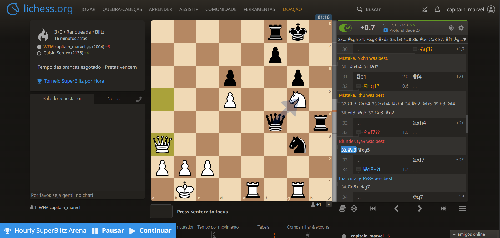
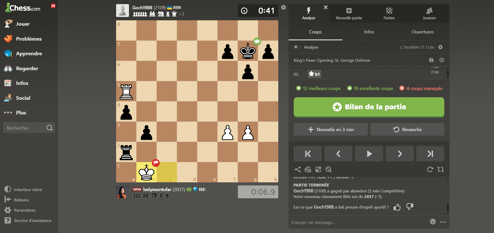

# Lichess

- A logo do lichess no campo superior esquerdo fica azul para mostrar que é clicável e é uma forma rápida de voltar para a página que tem as opções de pareamento.
- Os botões do menu se manteram, e o ícone de busca expande mostrando a palavra buscar com tipografia que chama pouco a atenção, mas que mostra onde você pode digitar sua busca.
- O tabuleiro é bem centralizado e faz contraste com todas as outras cores do site, se destacando.
- A conta no site também usa círculo, como nos outros sites

# Chess.com

- Tem uma barra lateral, os primeiro item são os principais e tem icones coloridos, abaixo tem os de configuração que estão em cinsa e em uma fonte menor.
- No centro está o jogo de xadrez, com os jogadores em um quadrado
- À diretia tem muita informação e tem quatro abas para dividí-las, as inforções estão em cinza e em destaque tem o botão de analiar a partida.